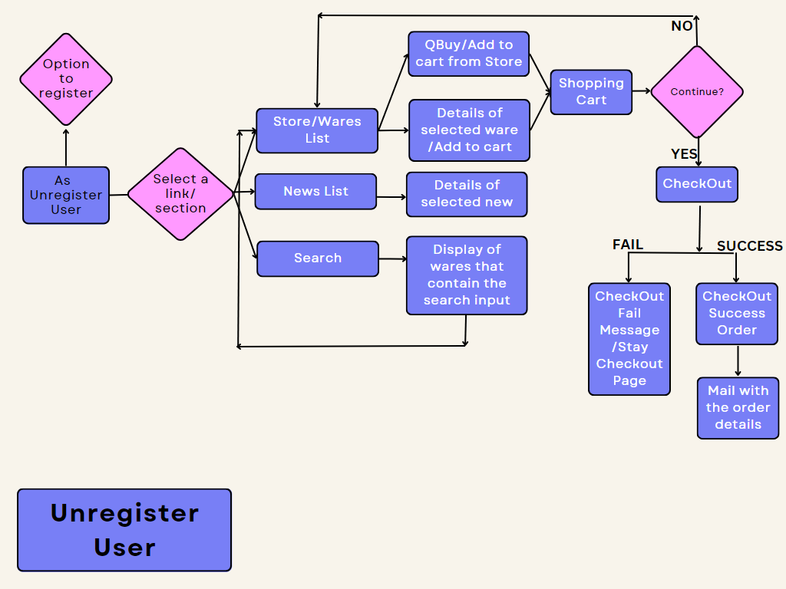
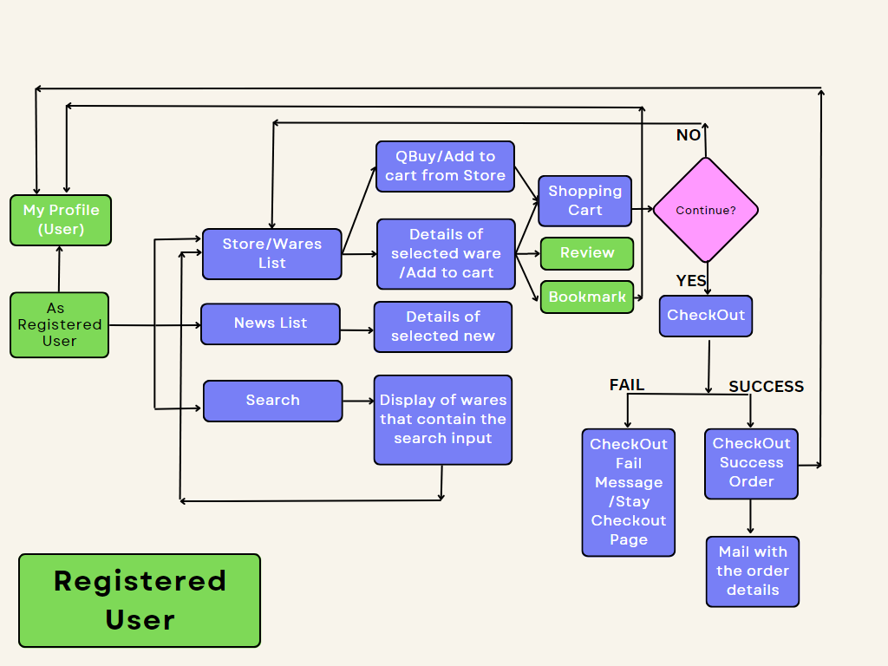
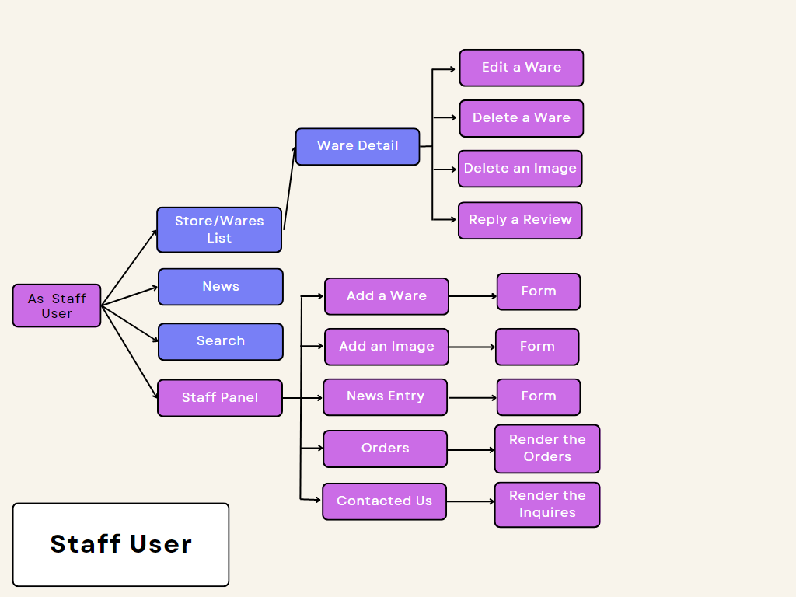
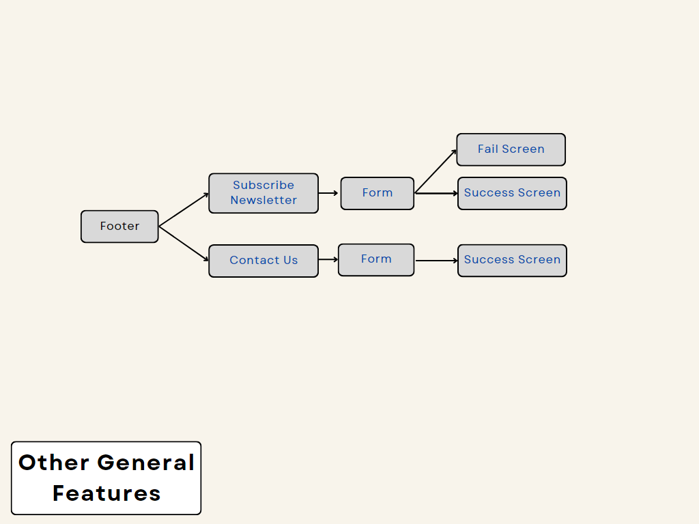

 

[💻Live Site](https://sebs-toy-store.herokuapp.com/)

# **About**
 
This project had been design to be a B2C e-commerce store. The products offered are video games and toys related to mostly. It also has a section for news about video games, and events and movies related to, in general useful information for who enjoy of the video games. This had been included thinking of expand the experience of the user in the app, seeing us not just as an e-commerce but a place to visit to find extras about their interests and so we can engage loyalty in the clients. This news should be keep constantly updating and so inform of new things up through the marketing strategy. 
 

# **Index**

- [Bussines Model](#bussines-model)
   - [Marketing Strategy](#marketing-strategy)
      - [SEO](#seo)

- [UX](#ux)

- [User Stories](#user-stories)
   - [User](#users)
   - [User Unregister](#unregistered-user)
   - [User Register](#registered-user)
   - [User Staff](#staff-user)

- [Features](#features)
   - [Features for Future Implementation](#features-to-implement-in-future)

- [Flowcharts](#flowcharts)
   - [Flowchart Unregister User](#user-unregister-👇)
   - [Flowchart Registered User](#user-registered-👇)
   - [Flowchart Staff User](#user-staff-👇)
   - [Flowchart Others](#other-👇)
- [DataBase Squema](#database-squema---elephant-sql)
- [Agile Methodology - Board](#agile-methodology)
- [Bugs](#bugs)
- [Design](#design)
- [Technologies Used](#technologies-used)
   - [Languages](#languages)
   - [Frameworks](#frameworks-and-libraries)
   - [Database Host](#database-host)
   - [Deployment Host](#deployment-host)
   - [Payment Platform](#payment-platform)
   - [Other Resources](#other-resources)

- [Validation](#validation)
- [Testing](#testing)
- [Deployment](#deployment)
- [Credits](#credits)

# **Bussines Model**
 
The project had been based in Business to Consumer (B2C) style. Being an e-commerce where wares for all the ages and interests. The slogan is a word game, since the "toys/wares" would come from the store.  
 

## **Marketing Strategy**
 

### **SEO**
Several SEO techniques were undertaken in order to ensure the site ranks highly in search engine results. Also the files robots.txt and sitemap.xml had been included. The sitemap.xml file had been created using [xml-sitemap](https://www.xml-sitemaps.com/)

**Keywords:**
 
Starting with a brain storms of keywords that are relevant to the e-commerce itself. And reduced by making use of a word search so target the more relevant, the site I had used is 

[wordtracker](https://www.wordtracker.com/)

**External Links:**
 
In the news section, each card/new contains a source link that would direct the user/client to source from where was taken the information so that they can find more about.

**Content marketing:**
 
The information and description of the wares in the site and other sections had been keep the more relevant to the site purpose. Also the keywords had been take in count when creating things like categories and such, so insure they are present without get to be spam. 
Each page has its own title, and finally meta tag description had been include in the base so that every page contains them.

**Social Media Marketing: Facebook**
 
The e-commerce has its own facebook, the one that will keep posting a minimun of three times a week, and releasing alerts of month offers and benefits, which are send by e-mail to the subscribers. This is for motivate the subscription to our newsletter and increase the clients database.

 

 

 

**Email Marketing**
This will be based in our newsletter service and also to the users that had purchased with us previously. The starting strategy is to produce a monthly mail with news arrivals and deals, also will contain some news about the gaming world, etc.
The user will recieve a welcome mail informing benefits will be coming in next mails. This refering to the monthly mail with deals, so the user dont feel overwhelmed with. 
For now there is a basic mail, but in future a better design will be implemented. Also had been set to recieve a report daily from mailchimp so that can be keep track of the traffic on it.
 

 

 

 

# **UX**
As target user, we are aiming for individuals that likes the video games and things related to, and on people that looks for a gift. We have a section with the news that are relevant to the wares offered. 

# **User Stories**
 

## **Users**

 
As User I want to be able to visualize and navigate through the sections of the app
   
   - Navbar 
   - Footer

As User I want to browse through the wares
   - Wares list view/Store

As User I want to been able to add and remove products from my cart
   - From list view/Store: QBuy button
   - From ware's details: Add to Cart button
   - Remove: From shopping cart remove link  

As User I want to see the news section
   - Link in Navbar

As User I want to subscribe to the store newletters
   - Form in Footer

As User I want to contact the staff if I require help or clarification of a process
   - Contact Form link in Footer

As User I want to see the reviews of the wares
   - Ware's details: Rendered in

## **Unregistered User**
 

As a Unregister User I want to get a benefit if I register
   - Information recieved in the registration mail

As Unregister User I want to see the purpose of the site when landing in it
   - Landing page with clear reference to objective of the app

As Unregister User, I want to be able to register so that I can create my account and access to the registered user features
   - Link for Sign Up in Navbar

As a Unregister User I want to see the detail information of the wares
   - Ware's details page
 

## **Registered User**
 

As a Register User I want to keep my information saved so that in a next purchase I don't have to fill the form again
   - Profile page

As a Register User I want to be able to update my information if need
   - Update Profile Form

As a Register User I want to keep and access to my bookmarked wares
   - Bookmark functionality with button in ware details page
   - Display of bookmarks in My Profile page

As a Register User I want to be able to leave a ware review if desire
   - Review Form

As a Register User I want to keep a history of my orders
   - Orders Section that display last 5 of them in My Profile

## **Staff User**
 
As a Staff/Admin User I want to access to an admin panel
   - Staff Panel page

As a Staff/Admin User I want to be able to reply the reviews if necessary
   - Reply to review form's link

As a Staff/Admin User I want to be able to manage the DB from the front-end
   - Staff Panel page:
      - Add a Ware Form
      - Add an Image Form
      - News Entry / Add a new
      - Orders (render them)
      - Contacted Us (render the inquiries)
   
   - Ware detail page:
      - Edit a ware
      - Delete a ware
      - Delete an image

As a Staff/Admin User I want to be able to manage the news section from the fron-end
   - News details page:
      - Edit a new
      - Delete a new

 

# **Features**
 
The list and screenshot about them can be found   

[here](readme_docs/md_files/features.md)

 

## **Features to Implement in Future**
 
As  the time frame was affected by external factors out of my control, some of the 'could have' features had been left for future implementation.
Howsoever fields and some of the need elements for them had been set in place since begin, and are there for when can be done.
Some of them are:

- New arrivals: There is a field in wares model to mark them and with a filter displaying, it is planned to use a blue ribbon in the front end as distintive feature.

- Clearance: As previous one, there is a field in wares model to mark them and with a filter displaying, it is planned to use a ribbon in
             the front end as distintive feature with a different colour than the New Arrivals, at the moment the idea is yellow.

- Bookmarks: There is a char field left in place, this is to implement a 'note' for the bookmark. As use find that bookmarks are very 
             valuables but sometimes you just cant remember what or why you did keep it, so if user/client can from their profile/bookmarks write a note so can remember if was for some ocassion or person, I think that will add value to they user experience.

- Bookmarks to Store List: Bring the bookmark feature to the list view, to show to the user if the ware is already bookmarked by them or not.

- Pages: Q&A, and Terms and Conditions had been provide for the moment with a under construction message.

- Profiles: The idea of increase the fields, with a profile section where the user can choose some of their prefer video games so   that store can include these wares in the stock. And also create a promotion section where can be display user's interests related items using the preference inputs.
 

# **Flowcharts**
 

## **User Unregister 👇**
 

## **User Registered 👇**
 

## **User Staff 👇**
 

## **Other  👇**
 

# **Database Squema - Elephant SQL**
 
For the data base had been used ElephantSQL, and the diagram is as below.

 

# **Agile Methodology**
 
For keep track of the Agile method I had used Project Board on GitHub.

[Sebs Toy Store Project Board](https://github.com/users/IvetteMcDermott/projects/15/views/1?layout=board).

# **Bugs**
 

The details to the bugs can be found [here](/readme_docs/md_files/bugs.md)

# **Design**
 

The wireframes can be found [here](/readme_docs/md_files/wireframes.md)

The details to the design can be found [here](/readme_docs/md_files/design.md)

# **Technologies Used**
 

## Languages

- [HTML](https://html.com/)

- [CSS](https://www.w3.org/Style/CSS/)

- [Python](https://www.python.org/)

- [JavaScript](https://www.javascript.com/)

## Frameworks and Libraries

- [Django](https://www.djangoproject.com/) 
   Documentation for [here](https://docs.djangoproject.com/en/4.1/intro/)

- [Jquery](https://jquery.com/) 

- [Boostrap](https://getbootstrap.com/)

- [Gunicorn](https://gunicorn.org/)

## Database Host

- [ElephantSQL](https://www.elephantsql.com/)  
   Documentation for set a database [here](https://www.elephantsql.com/docs/).

## Deployment Host

- [Heroku](https://id.heroku.com/login)

## Payment Platfomr

- [Stripe](https://stripe.com/ie)

## Other Resources

- [GitHub](https://github.com/)

- [GitPod](https://www.gitpod.io/)

- [Allauth](https://django-allauth.readthedocs.io/)

- [DjangoCrispyForms](https://django-cryptography.readthedocs.io/)

- [Cloudinary Media](https://cloudinary.com/)

- [Coolors](https://coolors.co/)

- [GoogleFonts](https://fonts.google.com/knowledge)

- [FontAwesome](https://fontawesome.com/)

# **Validation**
The validation reports can be found [here](./readme_docs/md_files/validation.md)

# **Testing**
The testing results can be found [here](./readme_docs/md_files/testing.md)

# **Deployment**
The site had been deployed through Heroku. The site had been developed on GitPod, committed and pushed to GitHub. And Heroku once the site is deployed would update automatically. The step for this can be found [here](/readme_docs/md_files/deployment.md)

# **Credits**

For this proyect I had take all the wares from Amazon App. The news has been take from t

[GamesHub](https://www.gameshub.com/news/features/all-the-big-video-game-events-in-2023-37270/)

[GameSpot](https://www.gamespot.com/articles/overwatch-2s-pve-mode-is-being-scrapped-blizzard-explains-what-happened-and-why/1100-6514242/)

[NintendoLife](https://www.nintendolife.com/news/2023/05/the-mario-movie-might-be-appearing-on-streaming-services-very-soon)