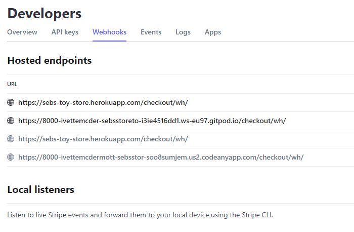
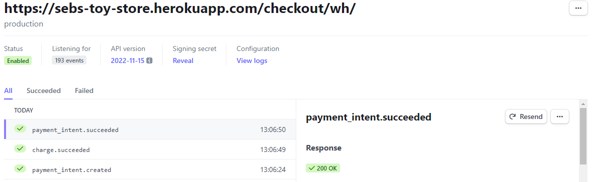
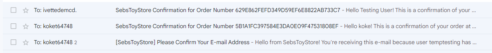
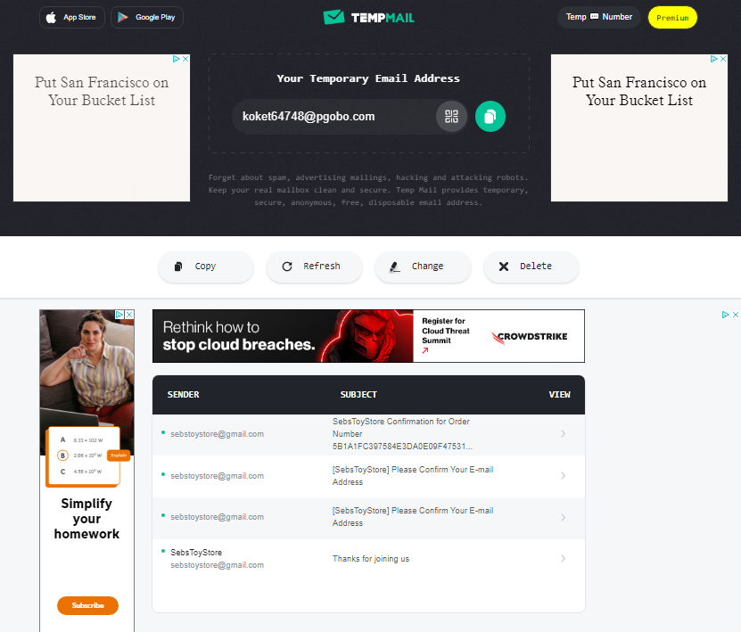

## Bugs Section
 

- **Shopping Cart:**  
    It was displaying an empty cart and still allowing to go to checkout page. 
     

    **Fix:** If empty now it gives a message on that, and checkout link is hidden.

- **The subcategories menu dropdown in store are toggled:**  
    They drop but won't close until the category that was clicked for open gets clicked again.  
    In small screens it could accumulate and become annoying.
     
    
    **Fix:** None. As it is expected toggle behaviour.

- **No callable object:**  
    That error came up couple of time refering to forms.
     

    **Fix:** Remove the () after form sort it. This was down to autocomplete. 
         It was edit functionality.

- **QBuy button in store cards:**  
    It would show at different level for each card.
     

    **Fix:** Gave height to title, so push the next div with the button to same position.

- **Template does not exist for checkout form:**  
    Access to checkout would give that error at early stages of the project.
     

    **Fix:** TA gave me direction to include the 'Crispyform_boostrap4' in installed apps, as it does not come as part of the Crispy_Forms as before.

- **Webhooks Local Port 8000:**  
    They stopped working everywhile. This was down to gitpod changing the port 8000 url.
     

    **Fix:** Update the endpoint when it's needed.

- **Webhook Production Site:**  
    I would not know how to explain why but it stopped working. I went to TA, and first thing we found it's for some reason I had removed the / at the end of the endpoint url, which was put back in place but after tests, still did not solve it. As running tests together, found that there was not apparent reason for it still down, so I was suggested to 'rotate' the local that was working with the one for production, as we had confirmation of the local endpoint working.
     

    **Fix:** After reviewing all the settings, I went for a new endpoint and disabled the old one for production, and that worked  
             not affecting the local one, and confirmed all was 100% up after testing.
 
    Webhooks Dashboard 👇
     

    
 

    New Webhook Up 👇
 
    
     

    Store Email - Sent 👇
 

        
 

    Temp Email - Inbox 👇
 
    
