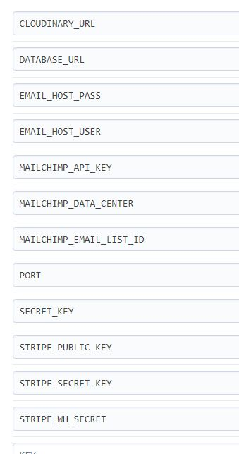
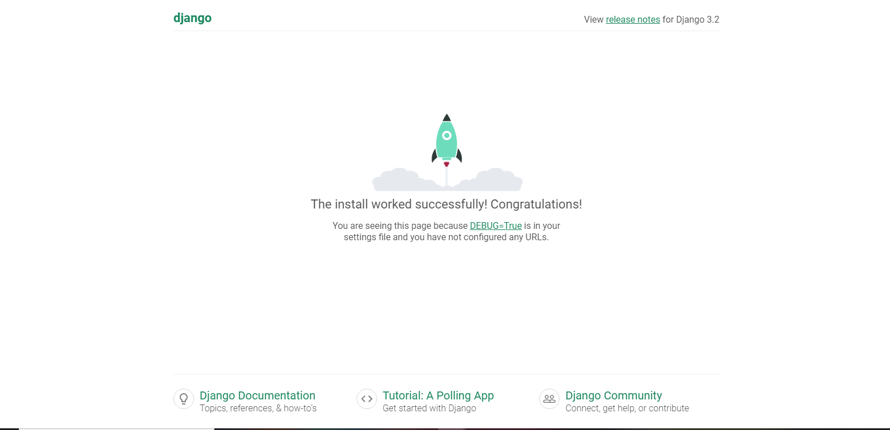
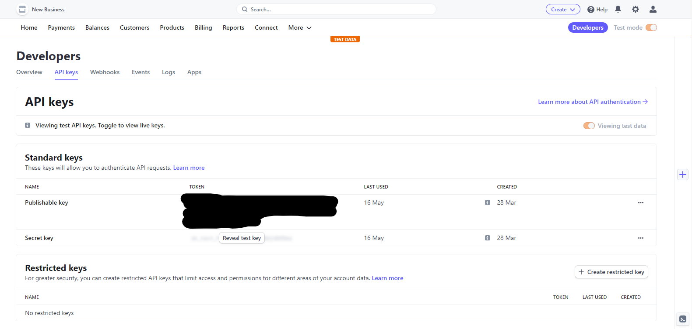
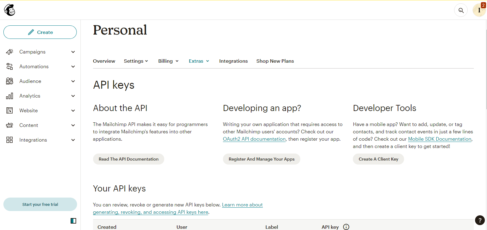
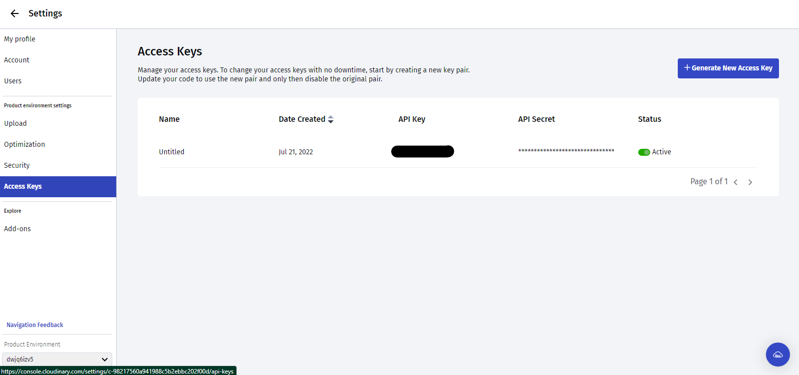
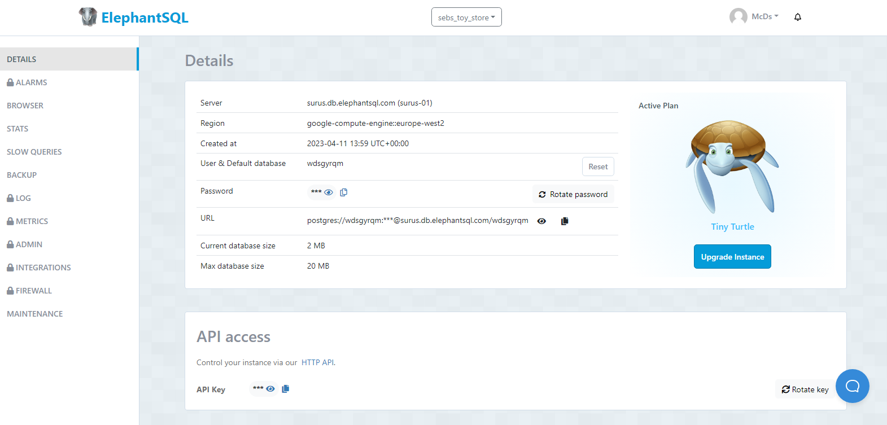

# **DEPLOYMENT PROCCESS**

**Log in Github.**

Open the repo to deploy. 
The one for the site is [here](!https://github.com/IvetteMcDermott/SebsStoreToys)

Steps to use this repository:

- Access to the repo in GitHub [here](https://github.com/IvetteMcDermott/SebsStoreToys).
- It can be "Fork" following the steps [here](../readme_imgs/).
- It can be "Clone" following the steps [here](../readme_imgs/).

**Log in Heroku.**

1. Click in the "New" button in the top right.
2. Select "Create New App"
3. Give a name to the App and choose a region.
4. Click in "Create App" button.
5. Click in Settings.
6. Click in Reveal Config.
7. Add Vars Config (keys):
   For this project had been need as ss below  

8. Go to Deploy in the nav bar. In Deploment Method, select GitHub/Connect to GitHub.
9. In Connect to GitHub, write the repository name and click in search.
10. Once the route for the repo appears under the search, click in "Connect" button.
11. The deployment can be Manual or Automatic, select the one of your preference. Automatic has the advantage of updating your deployed site as you push the commit in GitHub.
12. Verify that "Branch to deploy" is master/main.
13. Click Deploy.

## **Getting the variables for Heroku config vars.**

**Log in Stripe.**

1. In the dashboard click developers.
2. Click in API keys.
3. Copy the Publishable Key and add it as variable to the env.py and set the variable for it in settings.
4. Repeat the point 3 with Secret Key.
5. Click in webhooks.
6. In the right side can be found the "Add Endpoint", click on it.
7. Follow the instructions to add the url + '/checkout/wh'
8. Select the listener events and save it.
9. Repeat step 3 with this new key. 
   This will become our STRIPE_WH_SECRET variable.  
   In total with the previous three, our project will have 3 related to Stripe. These will go to Heroku config vars.

**Log in GMail (the one used for this project).**

1. In Config Vars set the EMAIL_HOST_USER variable with the email used for the project.
1. Go to settings of Google Account for the mail from step 1.
2. Search for App Password, and click in the one in Security.
3. Follow the instructions to select the device and generate the password.
4. Copy the App Password generated, add it to config vars as EMAIL_HOST_PASS.

**Log in MailChimp.**

1. Go to your profile.
2. Go to extras/API Keys.
3. Copy the API Key and do like done for Stripe ones, adding them to env.py and the varible in settings.
4. Go to audience, follow the steps and create an audience list.
5. Now to get the audience list id. Go to the your audience settings, and copy the Audience ID.
6. Treat the Audience ID as a key, include it in env.py and settings.
6. Include a html form code for the subscription with mailchimp in your app, mailchimp provides few options for.
7. These 2 variables will go heroku vars as well.

**Log in Cloudinary.**

1. Go to settings.
2. Go to Access Keys.
3. Copy the API Secret Key and do like done for Stripe ones, adding them to env.py and the varible in settings.
4. Set the directories for it in settings, according to what it will be use for.
5. This key will also go heroku vars.

**Log in ElephantSQL.**

1. Select the instance for this project.
2. In the details page, an API access section can be found where the one can be copy.
3. One more time, do same steps for previous Keys in env.py and to settings.
4. Add this key to heroku vars also.

**Django Key.**

You can find this one in your settings file in the project, remember to protected it and set it as the previous ones in env.py and variable in settings before commit or you would need generate a new one and do the mentioned steps. 

The Django Key generator can be found [here](https://djecrety.ir/).
