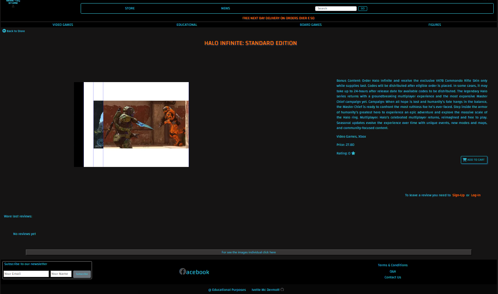
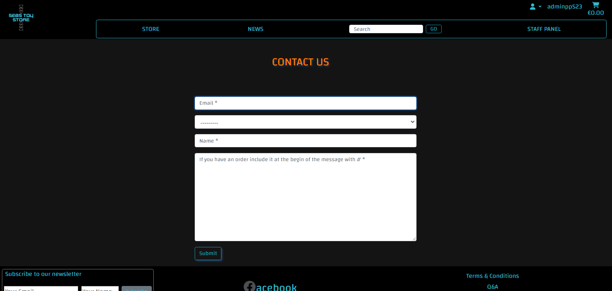
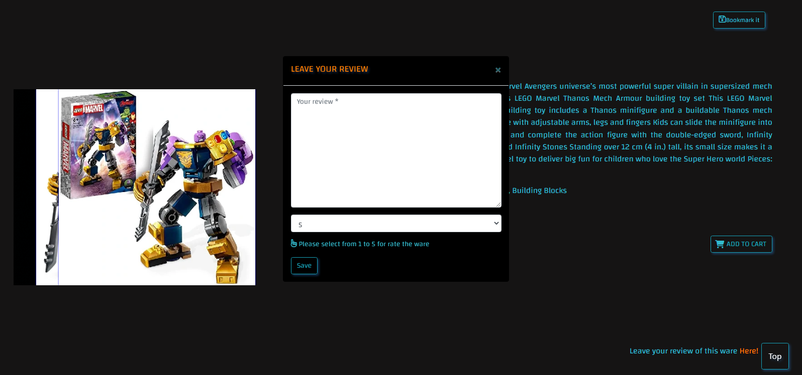

## **Design**  

For this project had been work a dark mode and bit of a 'gaming style', cards with effects on hover, accordions, colours that look near to neon, with shadows for a resemblance to 3D visual.

### **Color Scheme** 
 
The colours that had been pick as follow, generated in :

[Coolors](https://coolors.co/00c2d1-296eb4-ff7d00-2f2f2f-000000).

### **Font**
 
The font selected is Changa, which I think it complements the used ones in the logo and style.
It had been taken from:

[GoogleFonts](https://fonts.google.com/)

### **Logo**
 
It had been based on a template, it contains animation. The logo had been desing in:

[Canva](https://www.canva.com/en_gb/)

### **ScreenShots of the final result**
 

**Landing Page**
 

**Wares Page**
 

**Ware Details**
 

**Admin Page**
 

**Contact Us**
 

**Forms**
 
The forms had been differenced for users/clients they have placeholders and for staff with labels.  

User/Staff
 

User/Clients
 

