## **Features by Page**
 

## **Navbar**
 
The features will be displayed according to the logged user, as marked in features page
 

**Unregister User**
 

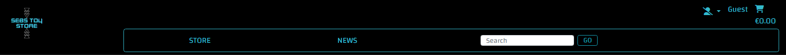
 
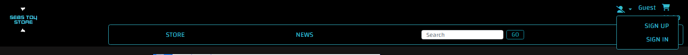
 

**Register User**
 

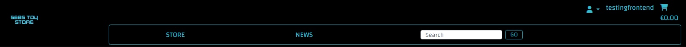
 
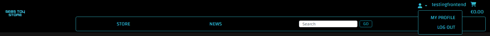
 

**Staff**
 

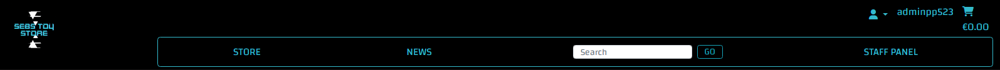
 
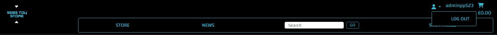
 

## **Messages**
 
This feature will be displayed for all the users, triggered by user's actions. It provides feedback to the users on the result of them.
 

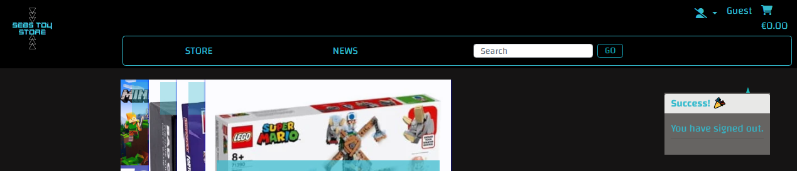
 

## **Footer**
 
The features will be displayed for all the users as follow.

 

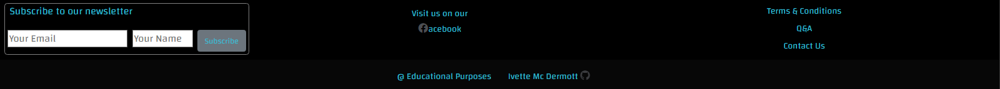

## **Landing Page**
 
Distinctive feature for this page: Page contains an image accordion.
 

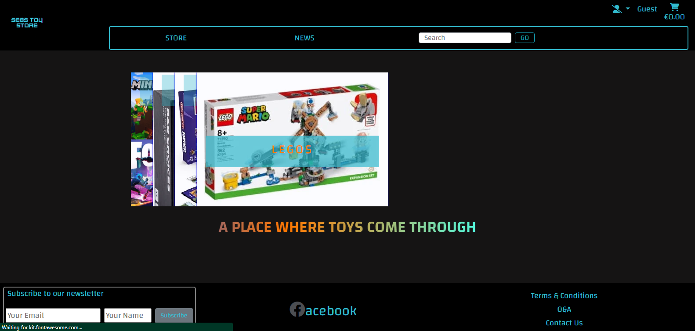

## **Wares Page**
 
Distinctive feature for this page: Animated banner with free delivery message, and filters by subcategories. Also contains a pagination display bar. These run to details page as well.
 

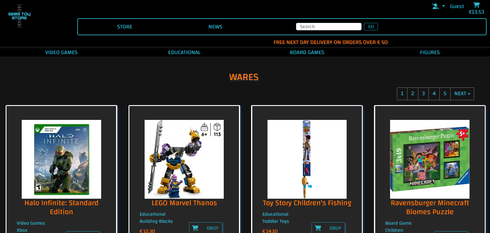

## **Ware Details**
 

**User/Clients**
 

Distinctive feature for this page: The images are presented in an accordion, and also the page has a toggle button that allows the user to open a div and visualize the images individually. Contains a return to store button as well.
 

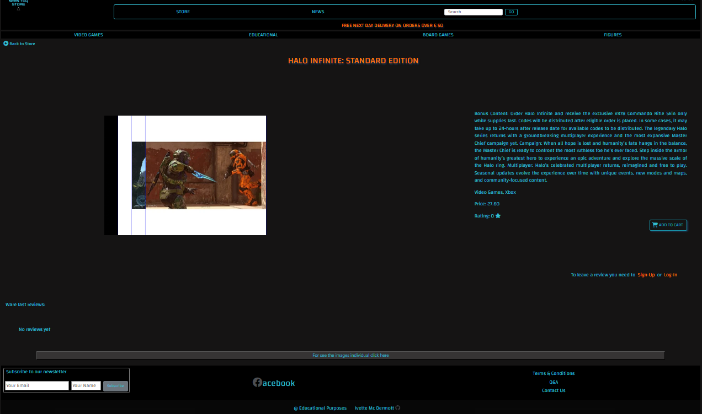

**Staff User**
 
For the staff the buttons for edit and delete the ware are being displayed. There is option to reply to the reviews just for staff users, and finally there is a button by image that allows to delete them individually.
 

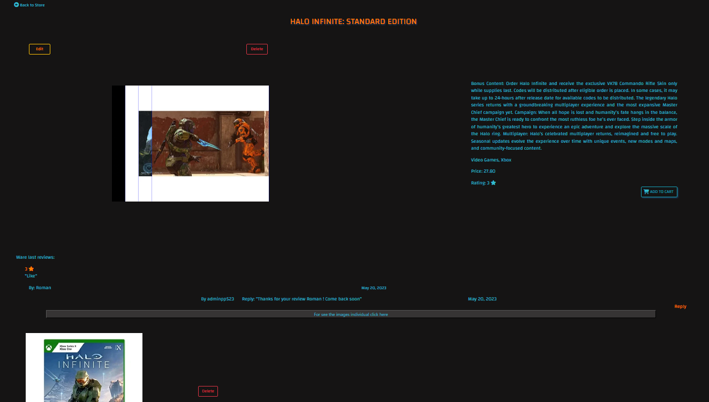

## **Staff Page**
 
This page contains the buttons that link to the forms and pages to be able to performe the necessary action.
 

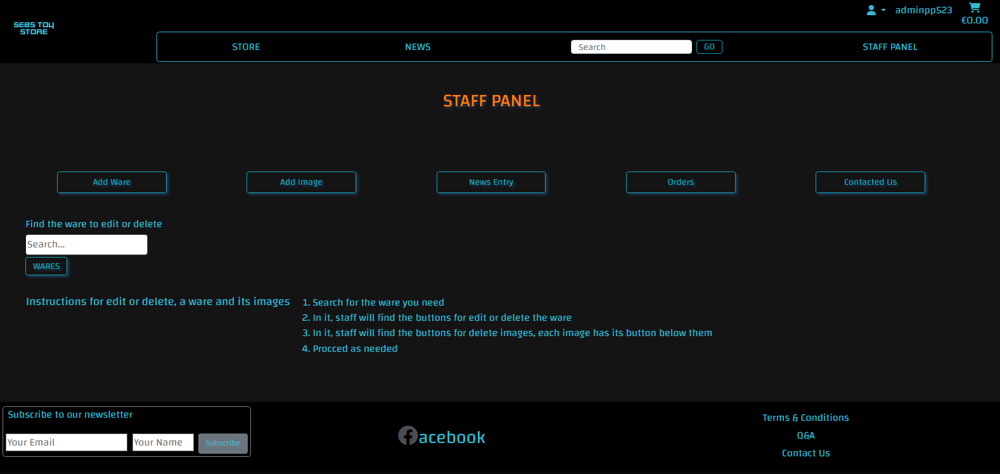

## **Contact Us**
 
This oage render a form for the user to submit their inquiry.
 

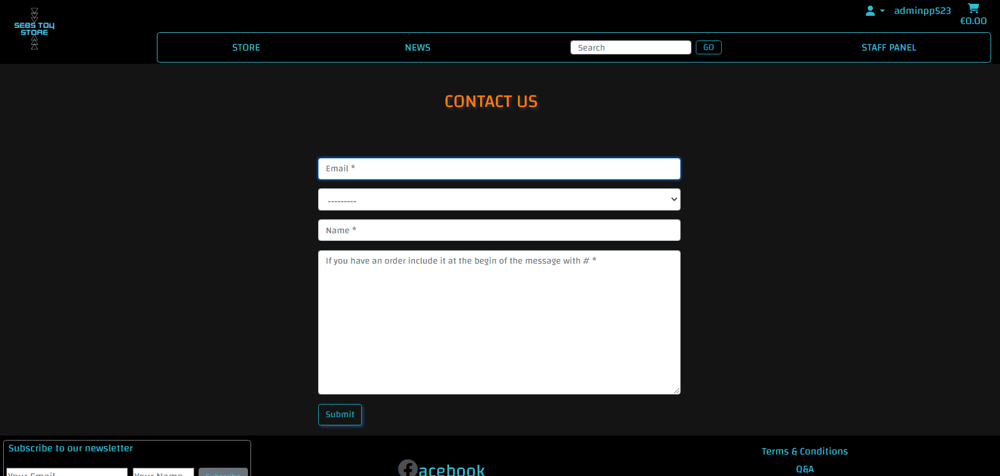

## **Forms**
 
The forms had been customized for users/clients they have placeholders and for staff have labels.  
 

**User/Clients**
 

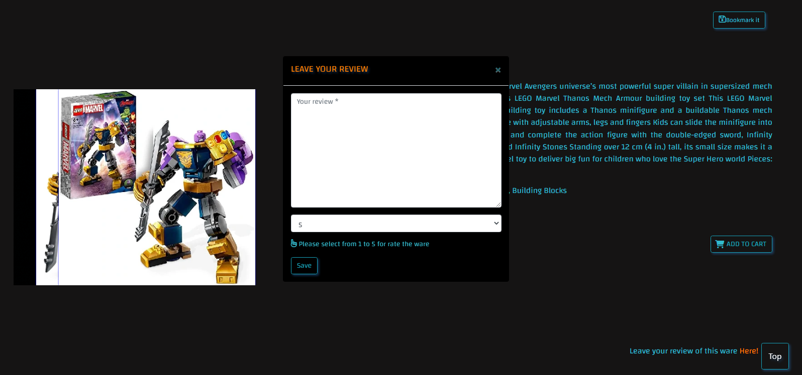

**User/Staff**
 

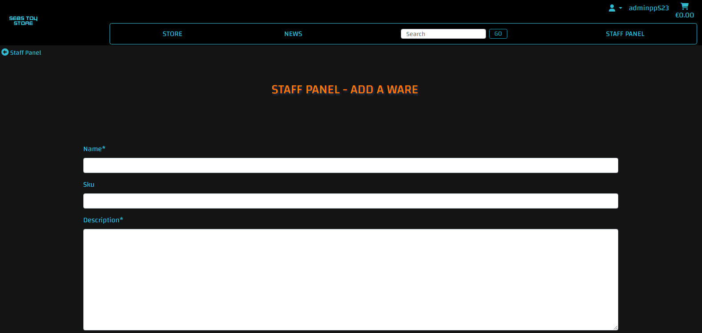
