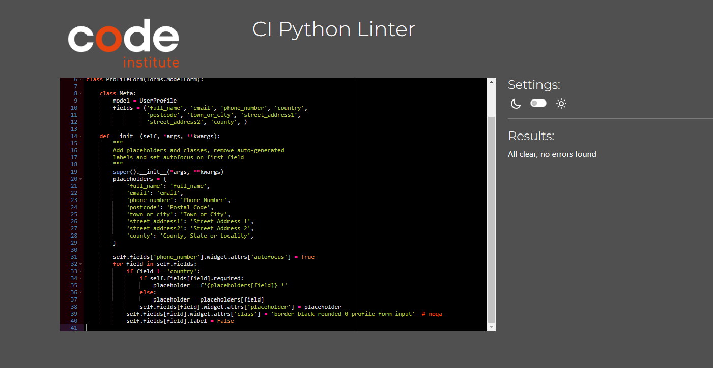
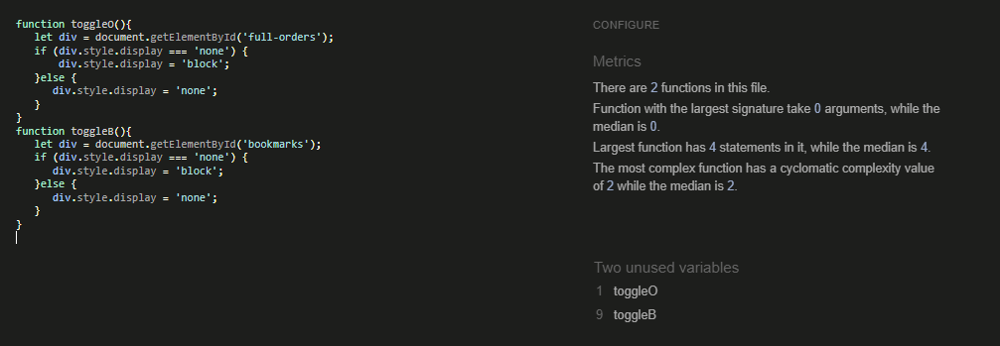

## **HTML**

### **PAGES**
 

**Validation for Landing Page**
 
The validation for this page had flag an error referent to the figure element, which is nesting inside other figure, this is part of the accordion animation, so down to the value of the animation to the site, it would be keep and register in the documentation.
 

**Validation for Store, Ware Details, News, New Detail, Contact us, Staff Panel and forms from Staff Panel**
 
The validation for these pages had come clean withouot error or warnings.
 

**Validation for Allauth Pages**
 
The validation for these pages had give a message info about a trailing slash. As its part of the Allauth I had not modified it.
 

## **Python**

All the files with .py extension had been validate with CI pep8 replacement, each admin, forms, models, urls and views for each app had pass by the validation in a first instance, mostly came out clean but some trail lines and minor issues that were solved, the second one after pushing all the changes had come clear for all the files. Below an example of the results.
 

## **Js**

All the files with .js extension had been validate with JsHint, the files for each app had pass by the validation in a first instance. There were couple of ; to be put in place and then it will light the variables/functions not being use or such, but they are being use in the html so they had been leave as it is. Below an example of the results.
 

## **CSS**

All the files with .css extension had been validate with W3C Validator, the files for each app had pass by the validation and come clean.
 

## **Lighthouse**

**Landing Page - Mobile**

 

**Landing Page - Desktop**

 

**Store Page - Mobile**

 

**Store Page - Desktop**

 

**Ware Details Page - Mobile**

 

**Ware Details Page - Desktop**

 

**News Page - Mobile**

 

**News Page - Desktop**

 

**New Details Page - Mobile**

 

**New Details Page - Desktop**

 

**Staff Panel Page - Mobile**

 

**Staff Panel Page - Desktop**

 